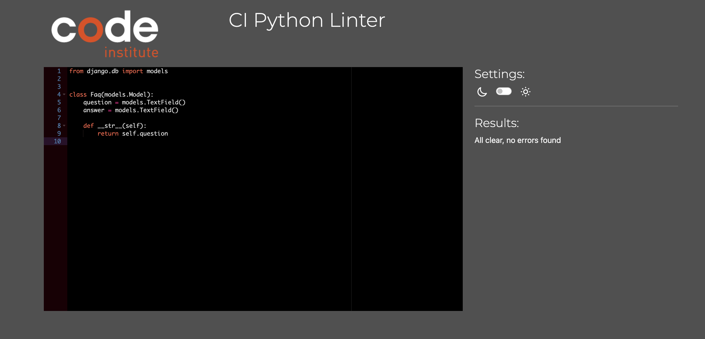
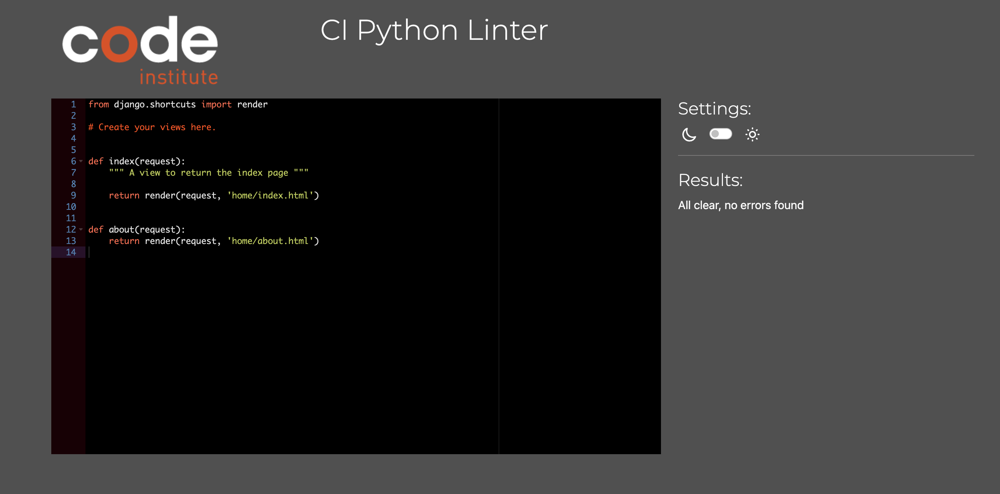
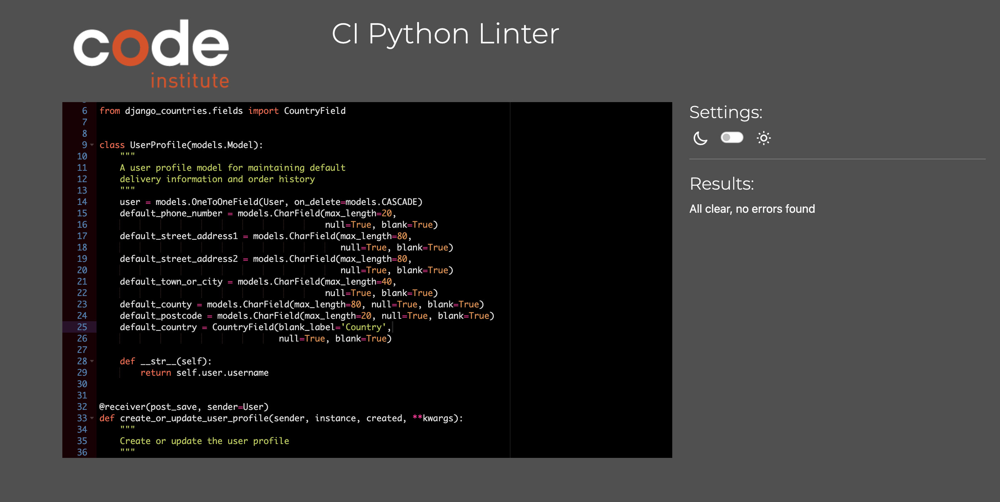

# Testing

Return back to the [README.md](README.md) file.

## Code Validation

### HTML

I have used the recommended [HTML W3C Validator](https://validator.w3.org) to validate all of my HTML files.

| Page | W3C URL | Screenshot | Notes |
| --- | --- | --- | --- |
| 404 | [W3C](https://validator.w3.org) |  | Pass: No Errors |
| about | [W3C](https://validator.w3.org) |  | Pass: No Errors |
| courses | [W3C](https://validator.w3.org) |  | Pass: No Errors |
| basket | [W3C](https://validator.w3.org) |  | Pass: No Errors |
| checkout | [W3C](https://validator.w3.org) |  | Pass: No Errors |
| checkout-success | [W3C](https://validator.w3.org) |  | Pass: No Errors |
| contact | [W3C](https://validator.w3.org) |  | Pass: No Errors |
| contact-confirm-delete | [W3C](https://validator.w3.org) |  | Pass: No Errors |
| contact-list |[W3C](https://validator.w3.org) |  | Pass: No Errors |
| contact-success | [W3C](https://validator.w3.org) |  | Pass: No Errors |
| contact-update-form |[W3C](https://validator.w3.org) |  | Pass: No Errors |
| email-form | [W3C](https://validator.w3.org) |  | Pass: No Errors |
| faq | [W3C](https://validator.w3.org) |  | Pass: No Errors |
| home | [W3C](https://validator.w3.org) |  | Pass: No Errors |
| profile | [W3C](https://validator.w3.org) |  | Pass: No Errors |
| register | [W3C](https://validator.w3.org) |  | Pass: No Errors |
| unsubscribe | [W3C](https://validator.w3.org) |  | Pass: No Errors |

### CSS

I have used the recommended [CSS Jigsaw Validator](https://jigsaw.w3.org/css-validator) to validate all of my CSS files.

| File | W3C | Screenshot | Notes |
| --- | --- | --- | --- |
| base.css | [W3C](https://jigsaw.w3.org/css-validator/) |  | Pass: No Errors |
| checkout.css | [W3C](https://jigsaw.w3.org/css-validator/) |  | Pass: No Errors |
| profile.css |[W3C](https://jigsaw.w3.org/css-validator/) |  | Pass: No Errors |

### JavaScript

I have used the recommended [JShint Validator](https://jshint.com) to validate all of my JS files.

| File | Screenshot | Notes |
| --- | --- | --- |
| stripe_elements.js |  | Undefined Stripe variable |
| countryfield.js |  | Pass: No Errors |

### Python

I have used the recommended [PEP8 CI Python Linter](https://pep8ci.herokuapp.com) to validate all of my Python files.

### Basket App
| File | CI URL | Screenshot | Notes |
| --- | --- | --- | --- |
| apps.py | [PEP8 CI](https://pep8ci.herokuapp.com) |  | Pass: No Errors |
| contexts.py | [PEP8 CI](https://pep8ci.herokuapp.com) |  | Pass: No Errors |
| tests.py | [PEP8 CI]((https://pep8ci.herokuapp.com)) |  | Pass: No Errors |
| urls.py | [PEP8 CI]((https://pep8ci.herokuapp.com)) |  | Pass: No Errors |
| views.py | [PEP8 CI](https://pep8ci.herokuapp.com) |  | Pass: No Errors |

### Checkout App
| File | CI URL | Screenshot | Notes |
| --- | --- | --- | --- |
| apps.py | [PEP8 CI](https://pep8ci.herokuapp.com) |  | Pass: No Errors |
| forms.py | [PEP8 CI](https://pep8ci.herokuapp.com) |  | Pass: No Errors |
| models.py | [PEP8 CI](https://pep8ci.herokuapp.com) |  | Pass: No Errors |
| signals.py | [PEP8 CI](https://pep8ci.herokuapp.com) |  | Pass: No Errors |
| tests.py | [PEP8 CI](https://pep8ci.herokuapp.com) |  | Pass: No Errors |
| urls.py | [PEP8 CI](https://pep8ci.herokuapp.com) |  | Pass: No Errors |
| views.py | [PEP8 CI](https://pep8ci.herokuapp.com) |  | Pass: No Errors |
| webhook_handler.py | [PEP8 CI](https://pep8ci.herokuapp.com) |  | Pass: No Errors |
| webhooks.py | [PEP8 CI](https://pep8ci.herokuapp.com) |  | Pass: No Errors |

### Mandala App
| File | CI URL | Screenshot | Notes |
| --- | --- | --- | --- |
| settings.py | [PEP8 CI](https://pep8ci.herokuapp.com) |  | Pass: No Errors |
| urls.py | [PEP8 CI](https://pep8ci.herokuapp.com) |  | Pass: No Errors |
| views.py | [PEP8 CI](https://pep8ci.herokuapp.com) |  | Pass: No Errors |

### Contact App
| File | CI URL | Screenshot | Notes |
| --- | --- | --- | --- |
| admin.py | [PEP8 CI](https://pep8ci.herokuapp.com) |  | Pass: No Errors |
| apps.py | [PEP8 CI](https://pep8ci.herokuapp.com) |  | Pass: No Errors |
| models.py | [PEP8 CI](https://pep8ci.herokuapp.com) |  | Pass: No Errors |
| tests.py | [PEP8 CI](https://pep8ci.herokuapp.com) |  | Pass: No Errors |
| urls.py | [PEP8 CI](https://pep8ci.herokuapp.com) |  | Pass: No Errors |
| views.py | [PEP8 CI](https://pep8ci.herokuapp.com) |  | Pass: No Errors |

### Faq App
| File | CI URL | Screenshot | Notes |
| --- | --- | --- | --- |
| admin.py | [PEP8 CI](https://pep8ci.herokuapp.com) |  | Pass: No Errors |
| apps.py | [PEP8 CI](https://pep8ci.herokuapp.com) |  | Pass: No Errors |
| models.py | [PEP8 CI](https://pep8ci.herokuapp.com) |  | Pass: No Errors |
| tests.py | [PEP8 CI](https://pep8ci.herokuapp.com) |  | Pass: No Errors |
| urls.py | [PEP8 CI](https://pep8ci.herokuapp.com) |  | Pass: No Errors |
| views.py | [PEP8 CI](https://pep8ci.herokuapp.com) |  | Pass: No Errors |

### Home App
| File | CI URL | Screenshot | Notes |
| --- | --- | --- | --- |
| apps.py | [PEP8 CI](https://pep8ci.herokuapp.com) |  | Pass: No Errors |
| tests.py | [PEP8 CI](https://pep8ci.herokuapp.com) |  | Pass: No Errors |
| urls.py | [PEP8 CI](https://pep8ci.herokuapp.com) |  | Pass: No Errors |
| views.py | [PEP8 CI](https://pep8ci.herokuapp.com) |  | Pass: No Errors |

### Newsletter App
| File | CI URL | Screenshot | Notes |
| --- | --- | --- | --- |
| admin.py | [PEP8 CI](https://pep8ci.herokuapp.com) |  | Pass: No Errors |
| apps.py | [PEP8 CI](https://pep8ci.herokuapp.com) |  | Pass: No Errors |
| models.py | [PEP8 CI](https://pep8ci.herokuapp.com) |  | Pass: No Errors |
| tests.py | [PEP8 CI](https://pep8ci.herokuapp.com) |  | Pass: No Errors |
| urls.py | [PEP8 CI](https://pep8ci.herokuapp.com) |  | Pass: No Errors |
| views.py | [PEP8 CI](https://pep8ci.herokuapp.com) |  | Pass: No Errors |

### Courses App
| File | CI URL | Screenshot | Notes |
| --- | --- | --- | --- |
| admin.py | [PEP8 CI](https://pep8ci.herokuapp.com) |  | Pass: No Errors |
| apps.py | [PEP8 CI](https://pep8ci.herokuapp.com) |  | Pass: No Errors |
| forms.py | [PEP8 CI](https://pep8ci.herokuapp.com) |  | Pass: No Errors |
| models.py | [PEP8 CI](https://pep8ci.herokuapp.com) |  | Pass: No Errors |
| tests.py | [PEP8 CI](https://pep8ci.herokuapp.com) |  | Pass: No Errors |
| urls.py | [PEP8 CI](https://pep8ci.herokuapp.com) |  | Pass: No Errors |
| views.py | [PEP8 CI](https://pep8ci.herokuapp.com) |  | Pass: No Errors |

### Profiles App
| File | CI URL | Screenshot | Notes |
| --- | --- | --- | --- |
| apps.py | [PEP8 CI](https://pep8ci.herokuapp.com) |  | Pass: No Errors |
| forms.py | [PEP8 CI](https://pep8ci.herokuapp.com) |  | Pass: No Errors |
| models.py | [PEP8 CI](https://pep8ci.herokuapp.com) |  | Pass: No Errors |
| tests.py | [PEP8 CI](https://pep8ci.herokuapp.com) |  | Pass: No Errors |
| urls.py | [PEP8 CI](https://pep8ci.herokuapp.com) |  | Pass: No Errors |
| views.py | [PEP8 CI](https://pep8ci.herokuapp.com) |  | Pass: No Errors |

### Root Level Files
| File | CI URL | Screenshot | Notes |
| --- | --- | --- | --- |
| custom_storages.py | [PEP8 CI](https://pep8ci.herokuapp.com) |  | Pass: No Errors |
| manage.py | [PEP8 CI](https://pep8ci.herokuapp.com) |  | Pass: No Errors |

## Browser Compatibility

I've tested my deployed project on multiple browsers to check for compatibility issues.

| Browser |  Notes |
| --- | --- |
| Brave |  Works as expected |
| Chrome | Works as expected |
| Edge | Works as expected |
| Firefox |  Works as expected |
| Internet Explorer | Multiple Broken Elements  |
| Opera | Works as expected |
| Safari | Works as expected |

## Lighthouse Audit

I've tested my deployed project using the Lighthouse Audit tool to check for any major issues.

On all pages, Lighthouse is flagging a warning 'Issues were logged in the Issues panel in Chrome Devtools'. This is caused by the built-in Stripe element used by the site.

| Page  | Desktop | Notes |
| --- | --- | --- |
| about |  | Some Minor Warnings |
| add-product |  | Some Minor Warnings |
| basket |  | Some Minor Warnings |
| checkout |  | Warning about country input element with no label - this element is dynamically labelled by javascript |
| contact |  | Some Minor Warnings |
| courses |  | Some Minor Warnings |
| faq | | Some Minor Warnings |
| home |   | Some Minor Warnings |
| login | | Some Minor Warnings |
| product-detail |  | Some Minor Warnings |
| profile | | Warning about country input element with no label - this element is dynamically labelled by javascript |
| subscribe | | Some Minor Warnings |

## Defensive Programming

Defensive programming was manually tested with the below user acceptance testing:

| Page | User Action | Expected Result | Pass/Fail | Comments |
| --- | --- | --- | --- | --- |
| Nav links | | | | |
| | Click on Logo | Redirection to Home page | Pass | |
| | Click on site name in navbar | Redirection to Home page | Pass | |
| | Click on About Us link in navbar | Redirection to About page | Pass | |
| | Click on Courses - All Courses link in navbar | Redirection to Courses page | Pass | |
| | Click on Courses - Classical link in navbar | Redirection to Courses page - Display only 'Classical' category courses | Pass | |
| | Click on Courses - Jazz link in navbar | Redirection to Courses page - Display only 'Jazz' category courses | Pass | |
| | Click on Courses - Pop link in navbar | Redirection to Courses page - Display only 'Pop' category courses | Pass | |
| | Click on Courses - Music Theory link in navbar | Redirection to Courses page - Display only 'Music Theory' category courses | Pass | |
| | Click on Faq link in navbar | Redirection to Faq page | Pass | |
| | Click on Contact link in navbar | Redirection to Contact page | Pass | |
| | Click on Search link in navbar | Search box dropdown, with input to search on courses page | Pass | |
| | Click on Register link in navbar | Redirection to Register page | Pass | |
| | Click on Login link in navbar | Redirection to Login page | Pass | |
| | Click on Basket link in navbar | Redirection to Basket page | Pass | |
| | Click on My Account - My Profile link in navbar | Redirection to User Profile page | Pass | |
| | Click on My Account - Logout link in navbar | Redirection to Logout page | Pass | |
| | Click on Add New course link in navbar | Redirection to Add course page | Pass | |
| | Click on Edit A Course link in navbar | Redirection to Courses page | Pass | |
| | Click on Delete A Course link in navbar | Redirection to Courses page | Pass | |
| | Click on Contact Requests link in navbar | Redirection to Contact Requests page | Pass | |
| Footer | | | | |
| | Click on Home link | Redirection to Home page | Pass | |
| | Click on Our Courses | Redirection to Courses page | Pass | |
| | Click on About Us link in footer | Redirection to About page | Pass | |
| | Click on Faqs link in footer | Redirection to Faq page | Pass | |
| | Click on Contact link in footer | Redirection to Contact page | Pass | |
| | Click on Register link in footer | Redirection to Register page | Pass | |
| | Click on Login link in footer | Redirection to Login page | Pass | |
| | Click on My Profile link in footer | Redirection to User Profile page | Pass | |
| | Click on Logout link in footer | Redirection to Logout page | Pass | |
| | Click on 'Subscribe to our mailing list' button in footer | Redirection to Newsletter Subscription page | Pass | |
| Register | | | | |
| | Enter valid email address (twice) | Field will only accept email address format | Pass | |
| | Enter valid password (twice) | Field will only accept password format | Pass | |
| | Click on Sign Up button | Redirects user to blank Login page | Pass |
| | Click on Back To Login button | Redirects user to Login page | Pass |
| Log In | | | | |
| | Enter valid username/email | Field will accept username or email format | Pass | |
| | Enter valid password | Field will only accept password format | Pass | |
| | Click Login button | Log user in, Redirects to home page | Pass | |
| Log Out | | | | |
| | Click Logout button | Logs out user, Redirects user to home page | Pass |
| Profile | | | | |
| | Click on the Update Information button | Inputted information is saved | Pass | |
| | Click on Order History links | Redirects to user order confirmation | Pass | |
| Site Navigations - Logged Out User | | | | |
| | Navigate to any login required URL | Redirect to login page, redirect back after login | Pass | |
| Courses | | | | |
| | Click on course image | Redirect to clicked course details page | Pass | |
| | Click on course title | Redirect to clicked course details page | Pass | |
| | Click on sorting dropdown options | Sort courses by selected criteria | Pass | |
| Courses - Admin Only| | | | |
| | Click on an edit button | Redirect to edit product page for that course | Pass | |
| | Click on a delete button | Trigger delete confirmation modal | Pass | |
| | Delete confirmation modal - 'yes, delete' button | Delete the course | Pass | |
| | Delete confirmation modal - 'no, go back' button | Close the modal | Pass | |
| Product Details | | | | |
| | Click on course image | Load full image | Pass | |
| | Click on 'Back To Our Courses' button | Redirect to courses page | Pass | |
| | Click on 'Add To Basket' button | Adds product to basket, basket message displayed | Pass | |
| Product Details - Admin Only | | | | |
| | Click on Edit button | Redirect to edit product page for that course | Pass | |
| | Click on Delete button | Trigger delete confirmation modal | Pass | |
| | Delete confirmation modal - 'yes, delete' button | Delete the course | Pass | |
| | Delete confirmation modal - 'no, go back' button | Close the modal | Pass | |
| FAQ | | | | |
| | Click on question | Dropdown with answer appears | Pass | |
| | Click on open question | Dropdown with answer disappears | Pass | |
| Contact | | | | |
| | Email input | Auto-fills if user is logged in | Pass | |
| | Email input | Required, accepts only email format | Pass | |
| | Name input | Required | Pass | |
| | Subject input | Required, user given a list of options | Pass | |
| | Message input | Required, Max characters = 1024 | Pass | |
| | Click on 'Send' button | Posts form if valid, redirects to contact success page | Pass | |
| Contact Requests - Admin Only | | | | |
| | Click on a 'View Details' link | Redirect to clicked message details page | Pass | |
| Message Details - Admin Only | | | | |
| | Click on 'Back To Contact List' link | Redirect to contact list page | Pass | |
| | Click on 'Respond To Message' button | Email dropdown appears | Pass | |
| | Click on 'Respond To Message' button while open | Email dropdown disappears | Pass | |
| | Click on a 'Send Email' button | Email is sent to displayed address, success message displayed, Respond button disappears | Pass | |
| | Click on 'Delete Message' button | Redirect to message delete confirmation page | Pass | |
| Message Delete - Admin Only | | | | |
| | Click on 'Yes, Delete It' button | Message is deleted, success message displayed, redirect to contact list page | Pass | |
| | Click on 'No, Go Back' button | Redirect to message details page | Pass | |
| Add New Product - Admin Only | | | | |
| | Category Input | Not required, select from options | Pass | |
| | Level Input | Not required, select from options | Pass | |
| | Level Display Name Input | Not required | Pass | |
| | Name Input | Required | Pass | |
| | Subtitle Input | Not required | Pass | |
| | Description Input | Required | Pass | |
| | Price Input | Required, Numbers only | Pass | |
| | Course URL | Not required | Pass | |
| | Image URL | Not required | Pass | |
| | Image | Not required | Pass | |
| Edit Product - Admin Only | | | | |
| | Click on 'Cancel' button | Redirect to Courses page | Pass | |
| | Click on 'Update Product' button | Save changes, redirect to course details page | Pass | |
| Delete Product - Admin Only | | | | |
| | Click on Delete button | Trigger delete confirmation modal | Pass | |
| | Delete confirmation modal - 'yes, delete' button | Delete the course | Pass | |
| | Delete confirmation modal - 'no, go back' button | Close the modal | Pass | |
| Basket | | | | |
| | Click on 'Remove This Item' link | Remove item from basket | Pass | |
| | Click on 'Back To Courses' button | Redirect to Courses page | Pass | |
| | Click on 'Secure Checkout' button | Redirect to Checkout page | Pass | |
| Checkout | | | | |
| | Full Name Input | Required | Pass | |
| | Email Input | Required, autofill if saved | Pass | |
| | Phone Number Input | Required, autofill if saved | Pass | |
| | Street Address 1 Input | Required, autofill if saved | Pass | |
| | Street Address 2 Input | Not required, autofill if saved | Pass | |
| | Town Or City Input | Required, autofill if saved | Pass | |
| | County Input | Not required, autofill if saved | Pass | |
| | Postal Code Input | Not required, autofill if saved | Pass | |
| | Country Input | Required, autofill if saved, select from options | Pass | |
| | Stripe Card Details | Required, validates on input | Pass | |
| | Hover over Address Details tooltip icon | Displays tooltip | Pass | |
| | Check 'save delivery info.' box | Saves information to user profile | Pass | |
| | Click course image in order summary | Redirect to the course details page | Pass | |
| | Click on 'Adjust Basket' button | Redirect to Basket page | Pass | |
| | Click on 'Complete Order' button | Complete Checkout with given information, redirect to order confirmation page if valid | Pass | |
| Newsletter - Subscribe | | | | |
| | Email Input | Required, autofills if user is logged in, accepts only email format | Pass | |
| | Click on 'Subscribe' button | Subscribes user, redirects to homepage, displays success message | Pass | |
| Newsletter - Unsubscribe | | | | |
| | Click on 'Unsubscribe' button | Unsubscribes user, redirects to homepage, displays success message | Pass | |

## User Story Testing

| User Story | 
| --- | 
| As a user I can fill out a front-end registration form so that I can make an account and have a personal presence on the site |
| As an admin I can hash & securely store users' passwords so that users' sensitive information remains secure | 
| As an admin I can save users' account details to a backend database so that users can create permanent accounts on my site | 
| As a user I can see and edit my personal user profile so that I can see my saved user details and other information such as past orders |
| As an admin I can send confirmation emails to registering users so that My registration process is more secure, and I validate all user emails when they register |
| As a user I can log in & out of my account so that I can see my profile and access login-only areas of the site, as well as log out to keep my account secure |
| As a user I can navigate around the site using links in a navbar so that I can easily access any area of the site I wish to see |
| As a user I can see different nav links depending on my login state so that I can see only the relevant nav links I need, and links such as 'login' are removed if I am logged in |
| As a user I can use buttons on site pages to bring me back/forward a step or bring me to a specific page so that when on an area of the site which naturally leads to or follows on from another specific site page, I can click a button provided to take me there. |
| As a user I can see prices of all products so that I have an accurate measure of the costs of all products that I view |
| As a user I can use my credit/debit card to pay for products so that I can use the online payment system on the site and receive my products, without dealing with cash payments |
| As an admin I can create orders & order numbers for user purchases so that orders can be organised & stored correctly, and reviewed if need be |
| As an admin I can initialise a secure chain of payment processes so that users cannot accidentally or intentionally interrupt the processing of their payment or their order creation after it has been initialised |
| As a user I can receive purchase confirmation emails so that I have confirmation of my order, and a record of my purchase and important order information | 
| As a user I can add products to my shopping basket so that I can pre-select them for possible purchase |
| As a user I can remove items from the basket so that they are not added to my order when I go to the checkout page |
| As a user I can see a running total of the price of all products in my basket so that I can, at a glance, see the total cost of my intended purchases | 
| As a user I can see and interact with a list of products available on the site | 
| As an admin I can create/read/update/delete products in a back-end database so that I have control over what products exist and are displayed for purchase on the site | !
| As a user I can search for and sort products so that I can easily find the most suitable product for my needs | !
| As a user I can see common error pages with user friendly messages and site-related styling so that I can more accurately understand why I have reached an error page, can still see all site related styling and have an option to return to the homepage |
| As a user I can see places where I can easily sign up for the site newsletter so that I can sign up without hassle |
| As an admin I can store user emails so that I can send them the site newsletter |
| As an admin I can add products to the site's database using a front-end form so that I can easily create new site products in a user-friendly way. |
| As an admin I can edit products on the site's database using a front-end form so that I can easily edit site products in a user-friendly way. |
| As an admin I can delete products from site's database using a front-end form so that I can easily delete existing site products in a user-friendly way. |
| As an admin I can keep an organised database of user profiles so that user profiles can be created and saved to the backend of the site. |
| As an admin I can Automatically create profiles for users upon registration so that users have a profile which displays their basic details, without having to manually create one after registering on the site |
| As a user I can create a profile after I make a purchase so that I can use the details provided during checkout to easily create a profile with all of my information pre-filled |
| As a user I can see and edit my profile page so that my profile details are viewable, and I can change them to match any changes in my information |

## Automated Testing

I have conducted a series of automated tests on my application.

I fully acknowledge and understand that, in a real-world scenario, an extensive set of additional tests would be more comprehensive.

### Python (Unit Testing)

I have used Django's built-in unit testing framework to test the application functionality.

In order to run the tests, I ran the following command in the terminal each time:

`python3 manage.py test name-of-app `

## Bugs

### Unfixed Bugs

- There is one error in html pages when we test in w3 html validator.
- script type error(i didn't removed it because incase if it give any errors with script).
- There is one error in unsubscribe page.In only one  device i couldn't able to see the button and it goes underneath the nav bar.I trie dto fix this when i contacted tutor support they will be able to to see that.I added one reference picture here.

- I can able to see on other devices .I added referenece picture here.

- There are no remaining bugs that I am aware of.

